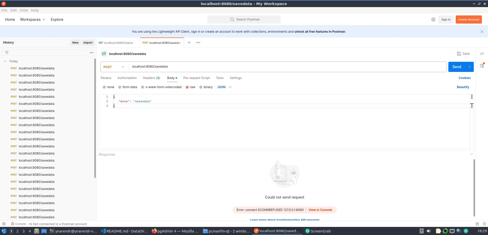
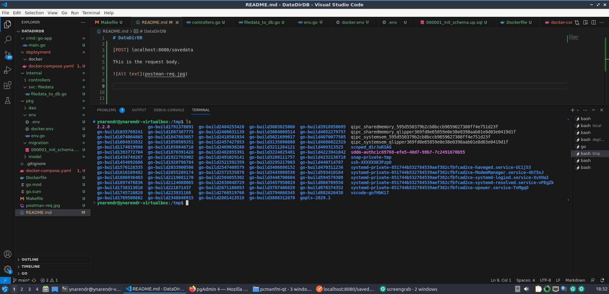
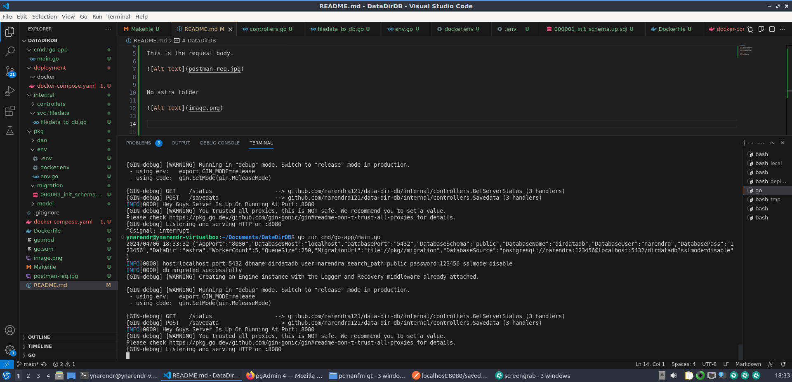
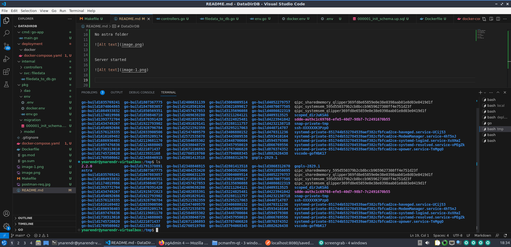
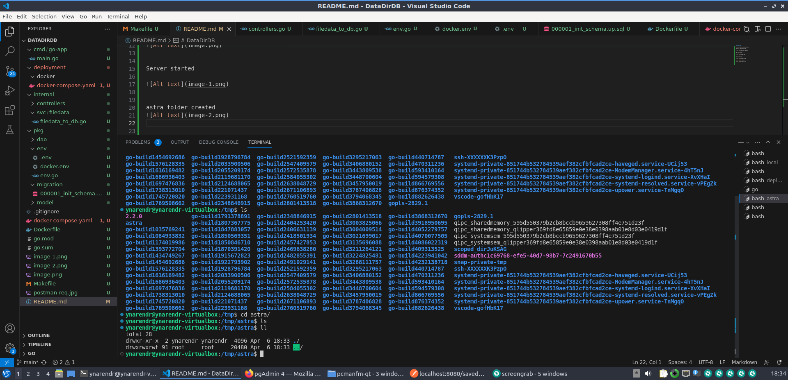
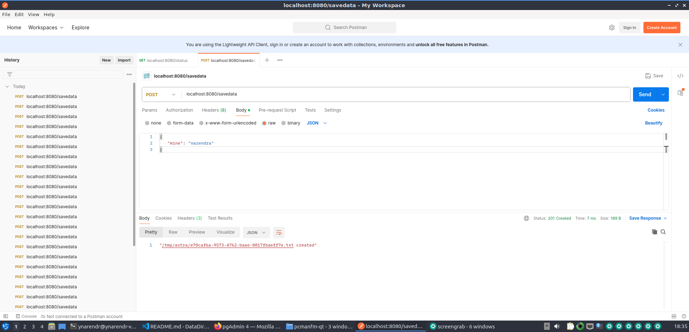
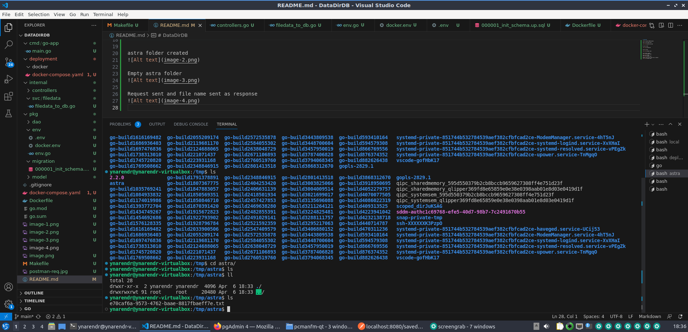
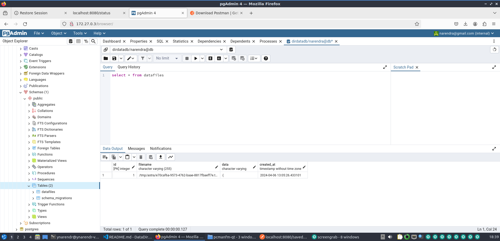

# DataDirDB

[POST] localhost:8080/savedata

This is the request body. 

No astra folder

Server started

astra folder created

Empty astra folder

Request sent and file name sent as response

File is created under astra folder

Same file is saved in db

